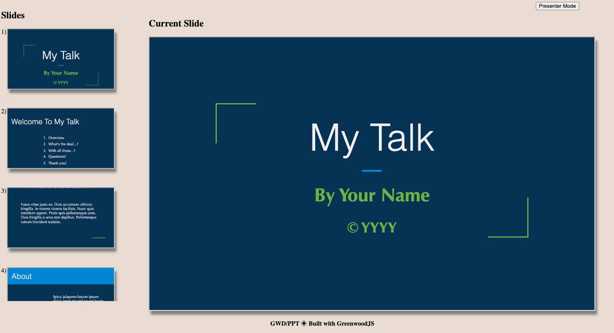

# greenwood-starter-presentation

Greenwood plugin and kickstarter repo for creating and authoring a slide deck from markdown, powered by [**GreenwoodJS**](https://www.greenwoodjs.io/)!  ♻️



[](https://app.netlify.com/sites/awesome-bhaskara-b7d76c/deploys)

## Installation

There are a couple options available for how you can use this project to kickstart your next presentation.

### Greenwood Plugin (recommended)
This project is principally intended to be consumed by a Greenwood project as a ["theme pack" plugin](https://www.greenwoodjs.io/guides/theme-packs/) installed from npm.  The advantage being that as enhancements and improvements are made to the project, you can pull those in just by updating a version number in your _package.json_.


> Check out these links to learn more [about Greenwood](https://www.greenwoodjs.io/about/) as well as the [Quick start guide](https://www.greenwoodjs.io/getting-started/).

To add this plugin to an _existing_ Greenwood project (where `@greenwood/cli` has already been installed), please do the following:

1. Install the plugin and its dependencies
    ```sh
    $ npm install @greenwood/plugin-import-css greenwood-starter-presentation --save-dev
    $ npm install lit-element 
    ```
1. Add this plugin and all dependent plugins to your _greenwood.config.js_
    ```js
    const pluginImportCss = require('@greenwood/plugin-import-css');
    const pluginThemePresentation = require('greenwood-starter-presentation');

    module.exports = {
      .
      .
      
      plugins: [
        ...pluginImportCss(),
        ...pluginThemePresentation()
      ]

    };
    ```
1. Create a markdown file in your _src/pages_ directory called _index.md_ with these contents
    ```md
    ---
    template: index
    ---
    ```

> _You can see an example of this project in use as a Greenwood plugin in [this repo](https://github.com/thescientist13/knowing-your-tco).  Feel free to clone or fork that or do whatever you want from there as well._


### Git (Fork / Clone)

You can also just fork and / or clone this repo from GitHub using `git`.

1. Clone the repo
    ```sh
    # Using SSH (recommended)
    $ git clone git@github.com:thescientist13/greenwood-starter-presentation.git

    # Using HTTP / GitHub Credentials
    $ git clone https://github.com/thescientist13/greenwood-starter-presentation.git
    ```
1. Change into the project directory and install dependencies
    ```sh
    $ cd greenwood-starter-presentation
    $ npm install
    ```

## Usage

For those unfamiliar, [CSS Zen Garden](http://www.csszengarden.com/) is a site the shares examples of designers and developers using the same HTML, but making completely unique looking layouts using just CSS.  The concept of a theme pack is an homage to this philosophy.  Just like you would have in Google Slides or Powerpoint, this project provides not only templates and styles to pre-theme and layout all your context, but also a complete UI to develop and present the slides with!


> _As this repo and plugin are both based on Greenwood, you are able to use all of Greenwood's [APIs](https://www.greenwoodjs.io/docs/) and [plugins](https://www.greenwoodjs.io/plugins/) in your own project too._


### Development

To start developing, simply run the `start` script

```sh
$ npm start
```

This will open a local development server for you at `localhost:1984`.

----

You can preview a production build by using the `serve` script

```sh
$ npm run serve
```

You can preview the final site at `localhost:8080`.

### User Interface

When you are running the app, the following controls and behaviors are available:
- Updating in any content will live reload the browser for you, preserving the focused slide.
- Scrolling and clicking any slide in the _Preview List_ on the left will make that slide appear in the _Current Slide) view.
- Clicking the _Presenter Mode_ button will enable Full Screen mode:
  - Navigate left and right using the left and right arrow keys
  - To exit presenter mode, hit the ESC key

### Slide Templates and Layouts

To organize your slide content, this plugin provides the following template that can be specificed in markdown file's frontmatter.

ex.
```md
---
template: theme-statement
---

Lorum Ipsum all my content....
```

1. `theme-center-content` - All content is positioned in the center both vertically and horizontally.
1. `theme-outline` - Centers a list in the middle of the page with a heading tag at the top/
1. `theme-statement` - A slide with content positioned in the bottom left hand corner to help emphasize a point.
1. `theme-title` - Provides an opening slide to highlight the talk title and author prominently in the center using heading tags.
1. `theme-top-title-image-left` - Positions an image in the lower left hand corner with content flowing to the right.
1. `theme-top-title` - Positions an `<h1>` at the top behind a page width banner using `--color-tertiary`, with any extra content positioned to the right of the page.
1. `page` -  (the default if no `template` is specified) - Will just display a slide with the `--color-primary` variable to the background color.

The supported structure for the above slides looks like this

#### Center Content
```md
---
template: theme-center-content
---

# What's the Deal...?

Lorum Ipsum
```

> See [_pages/slides/3.md_](https://github.com/thescientist13/greenwood-starter-presentation/blob/master/src/pages/slides/3.md) for an example.

#### Outline
```md
---
template: theme-outline
---

# My Talk Agenda

1. Intro
1. Topic 1
1. Topic 2
1. Topic 3
1. Thank you!
```

> See [_pages/slides/2.md_](https://github.com/thescientist13/greenwood-starter-presentation/blob/master/src/pages/slides/3.md) for an example.

#### Statement
```md
---
template: theme-statement
---

Spicy jalapeno bacon ipsum dolor.
```

> See [_pages/slides/6.md_](https://github.com/thescientist13/greenwood-starter-presentation/blob/master/src/pages/slides/1.md) for an example.

#### Title
```md
---
template: theme-title
---

# My Talk

## By Your Name
```

> See [_pages/slides/1.md_](https://github.com/thescientist13/greenwood-starter-presentation/blob/master/src/pages/slides/1.md) for an example.


#### Top Title Image Left
```md
---
template: theme-top-title-image-left
---

# Thank You!

@twitter_name


```

> See [_pages/slides/7.md_](https://github.com/thescientist13/greenwood-starter-presentation/blob/master/src/pages/slides/1.md) for an example.


#### Top Title
```md
---
template: theme-top-title
---

# Welcome To My Talk

Empty page body with an h1 at the top with `--color-secondary` color behind it as a top bar.
```

> See [_pages/slides/4.md_](https://github.com/thescientist13/greenwood-starter-presentation/blob/master/src/pages/slides/2.md) for an example.

----

> _Remember, you can always add your own HTML and <style> tags right into markdown.  Additionaly, Greenwood also supports ad-hoc and one off imports of CSS and JS via [frontmatter imports]() for extra customization!_

### Theming and Design System
The following global variables are provided to you to customize and override using [CSS custom properties](https://developer.mozilla.org/en-US/docs/Web/CSS/Using_CSS_custom_properties).

```css
:root {
  --color-primary: #135;
  --color-secondary: #74b238;
  --color-tertiary: #2b85da;
  --color-text-light: #efefef;
  --color-text-dark: #020202;
  --font-family: 'Optima', sans-serif;
  --font-size: 1.5rem;
  --backgroundUrl: url('../assets/background.jpg');
}

:host {
  --color-primary: #135;
  --color-secondary: #74b238;
  --color-tertiary: #2b85da;
  --color-text-light: #efefef;
  --color-text-dark: #020202;
  --font-family: 'Optima', sans-serif;
  --font-size: 1.5rem;
  --backgroundUrl: url('../assets/background.jpg');
}
```

## Support and Upgrades

### Known Issues

There a few open items in our issue tracker as we work to an [initial 1.0.0 release](https://github.com/thescientist13/greenwood-starter-presentation/milestone/1).  It would also be useful to be familiar with Greenwood's [Theme Pack FAQ](https://www.greenwoodjs.io/guides/theme-packs/#faq) if something isn't working as expected.

### Upgrades

To stay up to date with this repo depends on how you initialized your project or repo.

#### Plugin

If you using the plugin, any upgrades should just be as simple as uprading the version of this plugin in your _package.json_ using your package manager of choice.

```sh
# npm
$ npm install greenwood-starter-presentation

# yarn
$ yarn upgrade greenwood-starter-presentation --latest
```

#### Git

If you cloned this repo, then you should just be able to pull
```sh
$ git pull origin master
```

If you forked, make sure to add this repo as an upstream and pull changes in as needed
```sh
# use SSH (recommended) or HTTPS depending on your needs
$ git remote add upsteam git@github.com:thescientist13/greenwood-starter-presentation.git
$ git fetch upstream master
$ git checkout master
$ git merge upstream/master
```

> ⚠️ Note: By using git and this project, be aware that pulling in upstream changes could likely be prone to merge conflicts if you are changing anything other than _src/pages_.